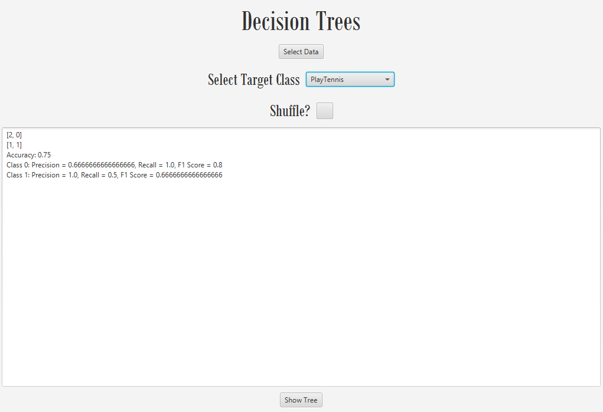
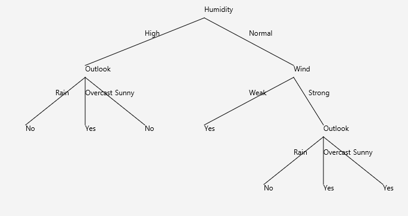

# Decision Tree Learning

## Overview

This project implements a Decision Tree algorithm from scratch, focusing on the core concepts of entropy, information gain, and gain ratio. The objective is to create a machine learning model that classifies the **Mushroom dataset** into edible and non-edible categories, without relying on pre-built machine learning libraries.

## Project Requirements

- **Algorithm Implementation**: Implement a decision tree algorithm from scratch, including:
  - **Entropy**: A measure of impurity in the data.
  - **Information Gain**: The reduction in entropy when a dataset is split on a given attribute.
  - **Gain Ratio**: The normalized measure of information gain.

- **Dataset**: Use the **Mushroom dataset** for testing the implementation. The target class is **Edible** (true or false).
  - Download the dataset: [Mushroom dataset](https://www.dropbox.com/scl/fi/v03uf6917up9qqcpyth7n/mushroom.csv?rlk=5p39t3ssq22z0914kdw7unchv&dl=0)

- **Testing**:
  - **Train-Test Split**: Split the dataset into a training set and a testing set.
  - **Evaluation Metrics**: After classification, calculate and display the following metrics for the test set:
    - Accuracy
    - Precision
    - Recall
    - F-Score

## Features

- **Data Preprocessing**:
  - Load and parse the Mushroom(or any nominal) datase.
  - Split the dataset into training and test sets.

- **Decision Tree**:
  - Build a decision tree using entropy and information gain.
  - Display the decision tree either in the command line or as a graphical output.

- **Evaluation**:
  - Calculate the performance metrics: accuracy, precision, recall, and F-score.
  - Display evaluation results after testing on the test set.

## Installation

1. **Clone the repository**:
   ```bash
   git clone https://github.com/yourusername/decision-tree-learning.git
   ```




